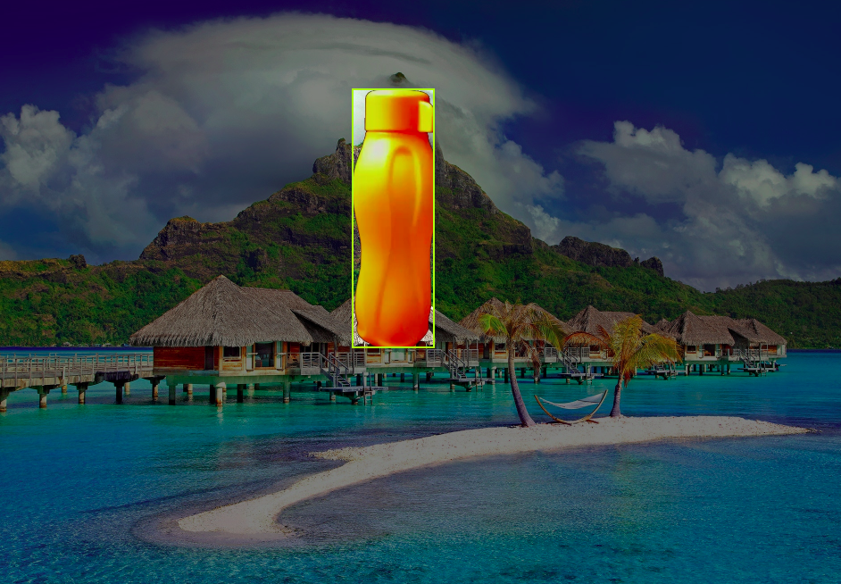

# Automatic Single Object Annotator

Annotating objects for object detection based applications is quite tedious and time consuming. 
In fact, can be expensive for researchers and students. 
This project will help researchers to use backgrounds and object images to 
generate annotated images in YOLOV5 format. 

## Requirements

Be sure to install the following dependencies if you do not have them already.

```
os module
python-opencv
Numpy 
Tqdm
```
You can directly install the dependencies using pip command.
- pip install package-name

### Generation Object Images

```
Use following command to generate image dataset from video required for object annotaion task.
```
- python3 bag_rm.py

```
This script will extract frames from a video & will convert black baground into trasparent. 
Also, it will remove extra white space present in an image to get tight bounding boxes.
```
In above script please enter below data:
- An absolute path of  video
- Parent directory path 
- Directory name in which you want to store the images

### Generate Annotations

You can use the following command to generate annotations

- python3 gen_annotations.py

``` 
This programs enables the creation of bounding boxes with backgrounds for object images.
This will help computer vision researchers and enthusiasts to generate annotations at faster rate & with good accuracy.
It will reduce the time required for manual data annotation task.
```
- An above script will generate two directories namely annotaions and images in ouput folder.

### Configurations
```
Use config.py file to add configurable parameter.
```
- BAGROUND_IMG_DIRECTORY : Enter an absoluter path of baground image folder
- OBJECT_IMG_DIRECTORY : Enter an absolute path of an object image folder
- OUTPUT_DIRECTORY : Enter an absolute path where you want to store the generated annotations & images
- NO_OF_OBJECTS: Enter the range of objects required per image. e.g. range(1,3). The range should start with 1.

# Showcase


